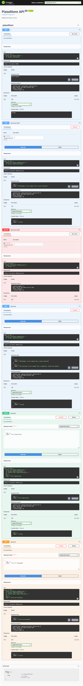

Este es un proyecto de **Web API**, creado gracias a [`ASP.NET Core`](https://dotnet.microsoft.com/es-es/learn/back-end-web-dev)

# 📄 Breve descripción
Este proyecto es una API mínima creada mediante ASP.NET Core y .NET 8. Incluye Swagger para asegurarnos de tener una manera de documentar la API.

se encuentra basado en el contenido Microsoft Learn [`Compilación de una API web con una API mínima, ASP.NET Core y .NET`](https://learn.microsoft.com/es-mx/training/modules/build-web-api-minimal-api/)

## Capturas de pantalla

🔵 Swagger

